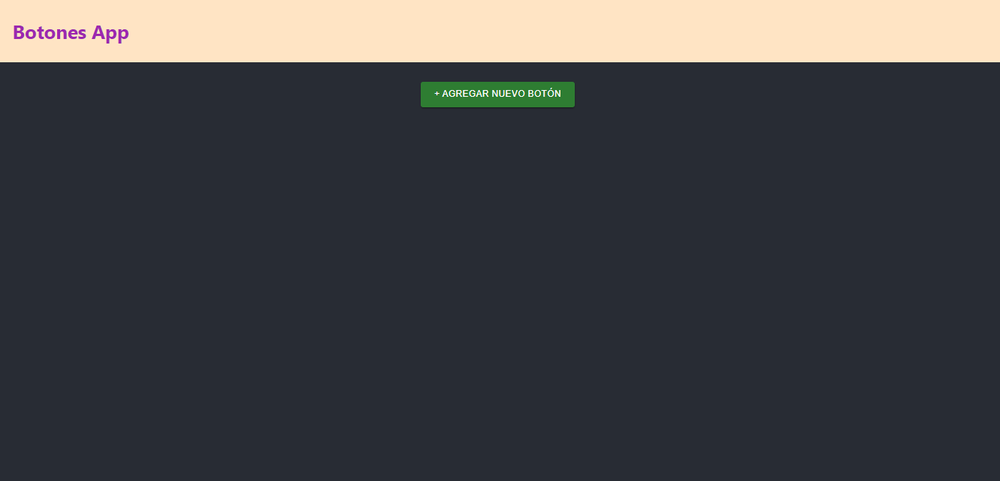
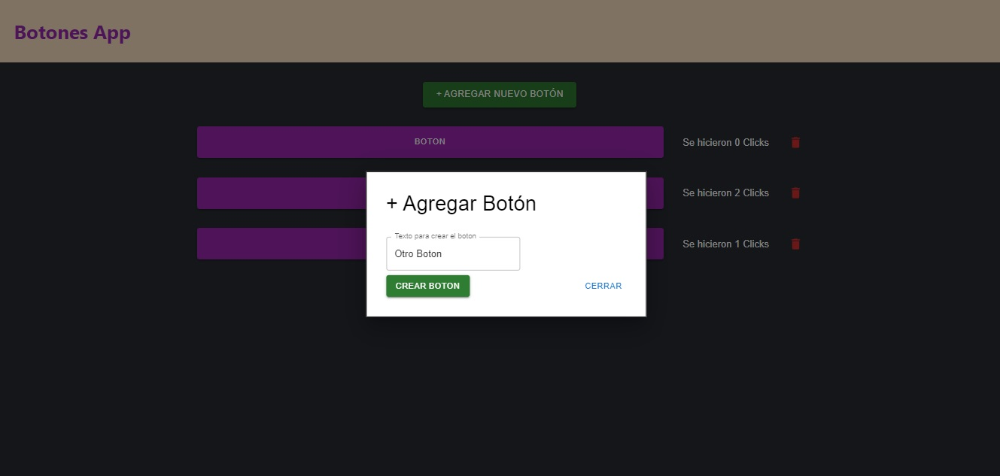
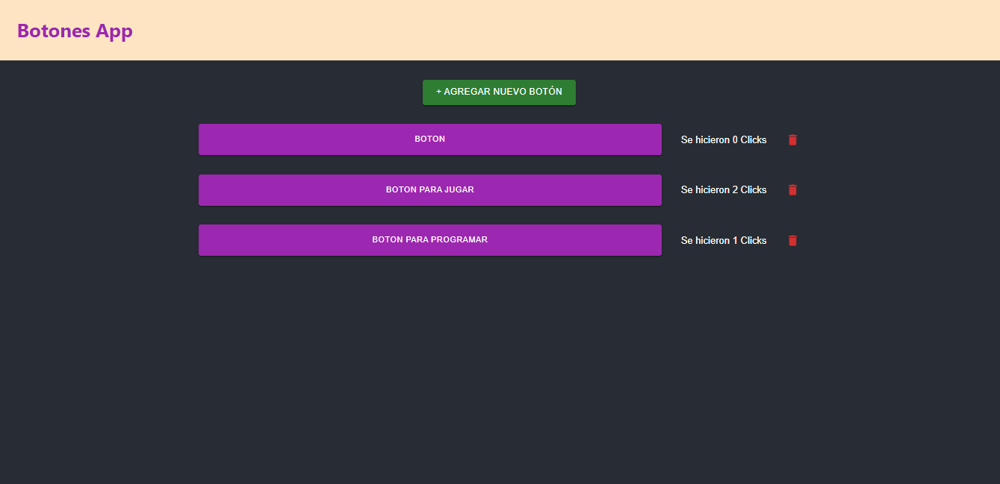

## Debemos crear una variable de entorno con el link donde corre nuestro servidor

Para la variable de entorno debemos crear el archivo .env .
Por defecto generlamente para la api utilizamos el puesto 3001 por lo que nuestra variable de entorno deve ser como se muestra acontinuacion :

    *REACT_APP_API_URL = http://localhost:3001/

En caso de usar otro puesto u otra url para el backend hacemos la modificacion correspondiente

# Pagina general de la aplicacion

Una vez levantada la App podemos encontranos con una vista como la siguiente

Haciendo click en el botton Agregar Nuevo Boton

Agregamos el nombre de como queremos que se llame nuestro nuevo boton

*Apartir de aqui cuando hacemos click en cada boton, internamete se agrega el numero de las veces clickeadas.
*Por otro lado si previonamos el icono de eliminar ese boton se quitara de la lista
